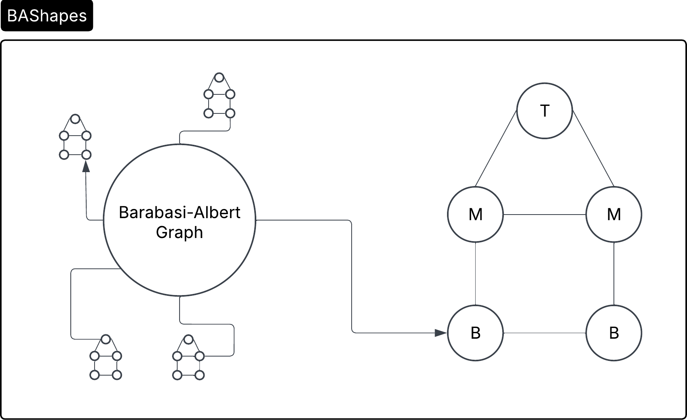
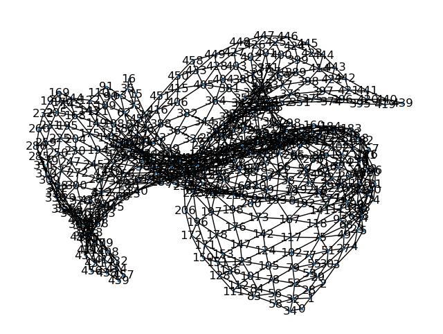
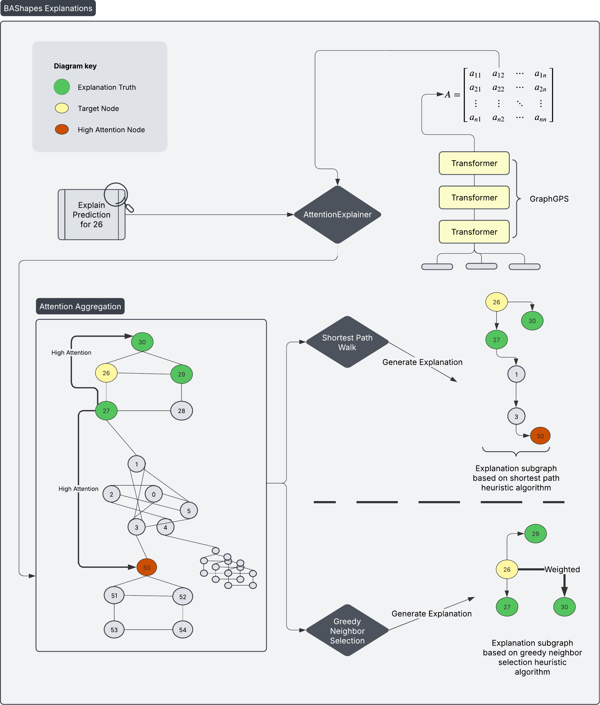
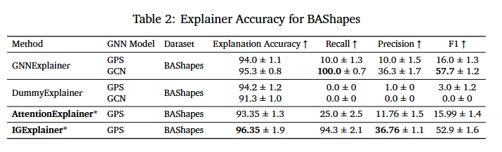
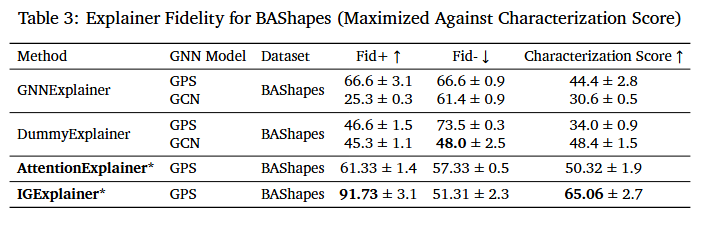
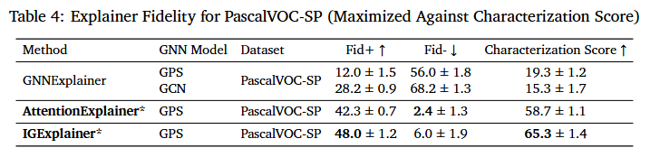

# Interpreting Graph Transformers for Long-Range Interactions

## Introduction

Graphs are used far and wide in every industry imaginable - they're used to model social networks, biological networks, supply chain systems, and more. 

Many powerful machine learning models analyze these graphs and the data and relationships within them to make predictions and perform other important tasks. However, these models are often extremely complex, rendering it difficult to reason about the decision-making process that they go through under the hood.

While interpretability explainers exist for some models, such as Graph Neural Networks (GNNs), not much research has been done on explainability for Graph Transformers, which are arguably more powerful due to their capability to capture long-range dependencies within graphs much more effectively. Inspired by existing graph explainability literature, we extended previous research with new methods and propose two new explainability methods for Graph Transformers- **AttentionExplainer** and **IGExplainer**.

Improved model transparency is vital to build trust in AI systems and enables stakeholders to assess model behavior, diagnose potential biases, and ensure alignment with ethical and regulatory standards. These models are applied in many industries that can have unintended consequences when not fully understood. By fostering a better understanding of such processes, neural network explainability supports accountability, facilitates model debugging, and drives crucial discussions related to ethicality, fairness, and societal impact.

## Methods

### Datasets

We use two datasets to benchmark our proposed explainers below, **BAShapes** and **PascalVOC-SP**.

#### BAShapes

BAShapes is a synthetically generated graph that has 25 central nodes, with 5 edges per node, with 10 house motifs attached. The labels of the node correspond to their role in the structure of the house (top, middle, bottom). This structure provides the axiom that nodes determine each other's classes based on their neighboring nodes and their labels, allowing us to obtain an explanation truth mask. Using BAShapes is critical in allowing us to assess the performance of our models because the ground truth for real-world datasets is unknown.

#### PascalVOC-SP

**PascalVOC-SP** is a node-classification graph dataset originating from semantic segmentation in computer vision. We use this dataset due to its presence of long-range interactions. This dataset has a multitude of graphs, so we selected one for node level, binary classification.

### Models

We propose two new explainers: **AttentionExplainer** and **IGExplainer**. In addition to these two, we've also implemented two existing explainers, GNNExplainer and DummyExplainer, for benchmarking and comparison purposes (reflected in the results section).

#### AttentionExplainer

For **AttentionExplainer**, we expose the attention matrices from each GPS Transformer layer during training and utilize them to determine our explanations, which are subgraphs that are generated from the original graph. Min-Max normalization is applied to each trained matrix, and they are all averaged. This final matrix is used to calculate and determine our subgraph explanations.

Once the attention matrix is finalized, two different algorithms can be used to generate the explanation subgraph:

* Greedily select the top K attention weights for node $$x_i$$, and perform a shortest path walk to generate subgraph explanation
* Greedily select the top K attention weights for node $$x_i$$ from its subset of neighbors to generate subgraph explanation

An example pipeline of an explanation for a node is illustrated below.

#### IGExplainer

**IGExplainer** utilizes integrated gradients to generate edge attributions (importance) to a prediction by linearly interpolating from a baseline (

## Metrics

We use a multitude of metrics to measure and quantify the efficacy and robustness of our methods to see where various explainers excel.

### Ground Truth, Recall, Precision

We use **ground truth accuracy**, **recall**, and **precision** only for BAShapes, as generated explanations on this dataset can be compared against a known explanation truth mask.

Ground truth accuracy refers to how accurate our generated explanation subgraphs are to the true mask. High ground truth accuracy means that an explainer can capture the proper house motif nodes in a generated explanation.

In addition to ground truth accuracy, we use recall and precision to paint a complete picture of our explainers' performance. Recall measures the proportion of accurate nodes captured in an explanation to all the true nodes. 

Precision captures the proportion of correct house motif nodes to all the predicted nodes in an explanation. This means that explainers with high precision will capture the correct the proper house motif nodes while ignoring the causally irrelevant ones.

F1-Score is a metric that provides a balanced measure of both recall and precision when evaluating the quality of an explanation.

### Fidelity and Characterization Scores

We use a metric called **Fidelity** to quantify how "necessary" and "sufficient" our generated explanations are. **Fidelity** has two submetrics for this - **Fid+** and **Fid-**.

* **Fid+** quantifies a "necessary" explanation. An explanation is deemed necessary if the model's prediction changes when it is removed from the initial graph.
* **Fid-** quantifies a "sufficient" explanation. An explanation is deemed sufficient if the model comes to the same initial prediction with just the explanation subgraph as the entire graph.

Characterization scores combine both Fidelity measures into one metric, where a higher value indicates better performance.

## Results

### BAShapes

This table indicates that **IGExplainer** performs the best on BAShapes with respect to **Explanation Accuracy** (Ground Truth Accuracy) and **Precision** for GPS models.

While **Explanation Accuracy** is high among all explainers, this can be attributed to the limited size of the explanation truth mask, and may not be truly indicative of the truth. Recall, precision, and F1-scores are all better indicators of the models' ability to capture the truth and generate the proper subgraph explanations. This is because recall and precision capture how well the explainer retrieves the relevant edges while avoiding
irrelevant ones.

When measuring **Fidelity** on BAShapes, or more specifically, **Characterization Score**, **IGExplainer** performs the highest with a score of 65.06, with **AttentionExplainer** performing the second highest with 50.32 compared to all other models. 

 We argue that **Fidelity** is more robust in providing assessments of explanation quality than the former metrics. This is because the former metrics' perceived effectiveness is highly dependent on the under-
lying model architecture. This dependency creates an undesirable entanglement between model decision-making and explanation generation, where an explanation may not align with the true underlying rationale but still faithfully represent how the model arrived at its decision. This is shown in the F1 Score and **Characterization Score** for **AttentionExplainer**, where a low F1-score is achieved in conjunction with a high **Characterization Score**.

### PascalVOC-SP

For PascalVOC-SP, the same is reflected as **IGExplainer** and **AttentionExplainer** are the top two performing models compared to the rest when measured against **Characterization Score**, indicating that these models are superior in explaining predictions made by transformer models, specifically GPS.

## Discussion

Our results indicate that **AttentionExplainer** and **IGExplainer** are the most robust compared to GNNExplainer and DummyExplainer when measured against Characterization Score for both BA-Shapes and PascalVOC-SP datasets. This means that **AttentionExplainer** and **IGExplainer** produce the highest-quality explanations that are both necessary and sufficient.

While the recall, precision, and F1 score is maximized on GNNExplainer, it is maximized on GCNs, and the high performance is not reflected when applied to GPS. **IGExplainer** displays competitive results to GNNExplainer in this regard, meaning that it captures  the relevant nodes in the explanations while avoiding the irrelevant ones.

Our metrics across all three tables for recall, precision, and fidelity demonstrate that **AttentionExplainer** and **IGExplainer** are able to effectively capture the decision-making within long-range interactions that occurs in graph transformers.

## Conclusion

To conclude, the importance of neural network explainability has grown alongside the increasing complexity of both data and model architectures. Specifically, graph neural network explainability aims to shed light on the decision-making processes of models that incorporate both features and relational structures during training. However, there is a notable gap in the literature regarding the explainability of graph transformers. To address this, we propose two methods: **AttentionExplainer** and **IGExplainer**. The former utilizes trained attention weights to greedily generate subgraph explanations, while the latter applies integrated gradients to compute edge attribution for each edge in the graph. Our approach is directly applicable to any graph transformer model that employs self-attention, offering a more appropriate explanation framework for this architecture compared to existing explainer techniques that are primarily designed for message-passing neural networks. Our explainer algorithms provide efficient and vital interpretations of graph transformer decision-making, providing critical model transparency, fairness, ethicality, and legal adherence.

## References

Alon, Uri, and Eran Yahav. 2020. “On the Bottleneck of Graph Neural Networks and its
Practical Implications.” CoRR abs/2006.05205. [Link]
Amara, Kenza, Rex Ying, Zitao Zhang, Zhihao Han, Yinan Shan, Ulrik Brandes, Sebas-
tian Schemm, and Ce Zhang. 2024. “GraphFramEx: Towards Systematic Evaluation of
Explainability Methods for Graph Neural Networks.” [Link]
Dwivedi, Vijay Prakash, Anh Tuan Luu, Thomas Laurent, Yoshua Bengio, and Xavier
Bresson. 2021. “Graph Neural Networks with Learnable Structural and Positional Rep-
resentations.” CoRR abs/2110.07875. [Link]
Dwivedi, Vijay Prakash, Ladislav Rampášek, Mikhail Galkin, Ali Parviz, Guy Wolf,
Anh Tuan Luu, and Dominique Beaini. 2023. “Long Range Graph Benchmark.” [Link]
Luo, Dongsheng, Wei Cheng, Dongkuan Xu, Wenchao Yu, Bo Zong, Haifeng Chen,
and Xiang Zhang. 2020. “Parameterized Explainer for Graph Neural Network.” CoRR
abs/2011.04573. [Link]
Rampášek, Ladislav, Mikhail Galkin, Vijay Prakash Dwivedi, Anh Tuan Luu, Guy Wolf,
and Dominique Beaiani. 2023. “Recipe for a General, Powerful, Scalable Graph Trans-
former.” [Link]
Rusch, T. Konstantin, Michael M. Bronstein, and Siddhartha Mishra. 2023. “A Survey
on Oversmoothing in Graph Neural Networks.” [Link]
Sundararajan, Mukund, Ankur Taly, and Qiqi Yan. 2017. “Axiomatic Attribution for Deep
Networks.” CoRR abs/1703.01365. [Link]
Vaswani, Ashish, Noam Shazeer, Niki Parmar, Jakob Uszkoreit, Llion Jones, Aidan N.
Gomez, Lukasz Kaiser, and Illia Polosukhin. 2017. “Attention Is All You Need.” CoRR
abs/1706.03762. [Link]
Veličković, Petar, Guillem Cucurull, Arantxa Casanova, Adriana Romero, Pietro Liò,
and Yoshua Bengio. 2018. “Graph Attention Networks.” [Link]
Wallace, Eric, Jens Tuyls, Junlin Wang, Sanjay Subramanian, Matt Gardner, and
Sameer Singh. 2019. “AllenNLP Interpret: A Framework for Explaining Predictions of
NLP Models.” In Proceedings of the 2019 Conference on Empirical Methods in Natural Lan-
guage Processing and the 9th International Joint Conference on Natural Language Processing
(EMNLP-IJCNLP): System Demonstrations. Hong Kong, China Association for Computa-
tional Linguistics. [Link]
Ying, Rex, Dylan Bourgeois, Jiaxuan You, Marinka Zitnik, and Jure Leskovec. 2019.
“GNN Explainer: A Tool for Post-hoc Explanation of Graph Neural Networks.” CoRR
abs/1903.03894. [Link]
